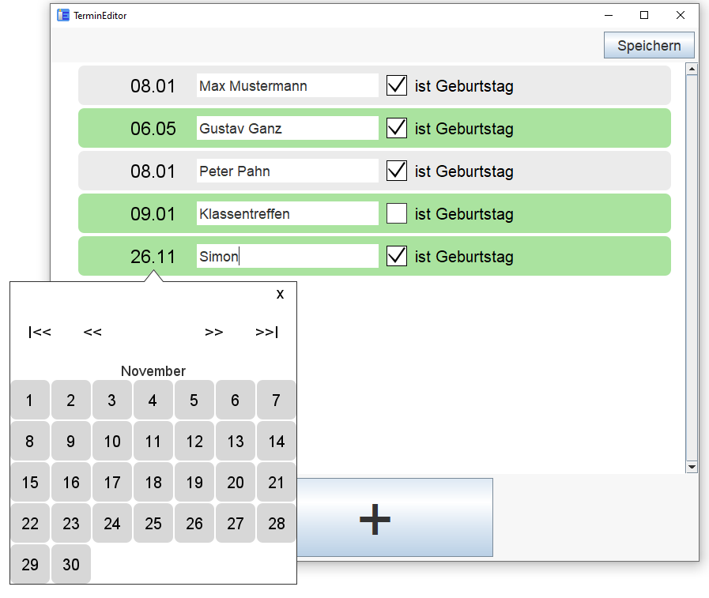
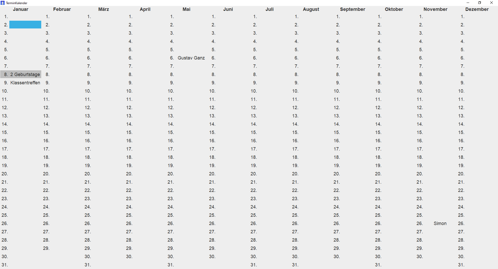
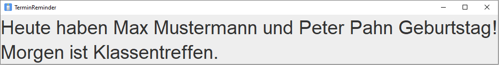

# AppointmentHelper

A set of tools to organize events which occur on the same day every year, e.g., birthdays, wedding days etc.

This is my first ever programming project.

 Tool     | What it does                                                                        
----------|-------------------------------------------------------------------------------------
 Editor   | Add, change and delete appointments                                                 
 Calendar | Overview of all stored appointments                                                 
 Reminder | Shows appointments which occur today or tomorrow (at the time the tool is executed) 

## Screenshots of example tool views

Example view of the editor:

  

Example view of the calendar:

  

Example view of the reminder:

  

## Build

1. Clone this repository.
1. Run `mvn package`.
1. Each target folder of the modules `Editor`, `Calendar` and `Reminder` contains an `.exe` file which wraps the
   Maven-generated `.jar`. (jar could be used equivalently, but has no custom icon)
1. Move all `.exe` files to a common folder (where u want to store them).

## Usage

1. Add environment variable `APPOINTMENTS_FILE_PATH` and point it to a file where you would like to have your
   appointments stored, e.g., a location that is regularly backed up. The file does not need to exist, any `.exe` will
   create an empty config file at the configured location, if there is no file. For example, you could choose
   `C:\Users\<User>\OneDrive\appointments.json`.
1. Configure the execution of the `Reminder` in the task scheduler tool of your OS to run the `Reminder.exe` on your
   desired schedule, e.g., when your computer starts and at 00:00 every day
1. Enter your appointments with the `Editor`
1. A window will become visible if an appointment occurs today or will occur tomorrow (at the time the `Reminder` is
   executed)
1. You can always look at an overview of all appointments with the `Calendar`
